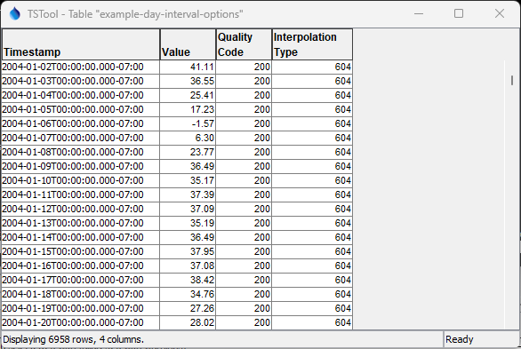
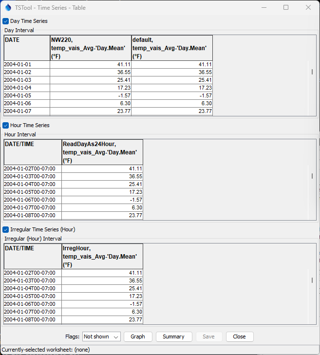

# TSTool / Command / ReadKiWIS #

*   [Overview](#overview)
*   [Command Editor](#command-editor)
    +   [Match Single Time Series](#match-single-time-series)
    +   [Match 1+ Time Series](#match-1-time-series)
*   [Command Syntax](#command-syntax)
*   [Examples](#examples)
    +   [Example Daily Time Series](#example-daily-time-series)
*   [Troubleshooting](#troubleshooting)
*   [See Also](#see-also)

-------------------------

## Overview ##

The `ReadKiWIS` command reads one or more time series from KiWIS web services:

*   Read a single time series by matching a TSTool time series identifier (TSID).
*   Read 1+ time series using filters similar to the main TSTool window.

See the [KiWIS Data Web Services Appendix](../../datastore-ref/KiWIS/KiWIS.md)
for more information about KiWIS web service integration and limitations.
The command is designed to utilize web service query criteria to process large numbers of time series,
for example to produce real-time information products and perform historical data analysis and quality control.

See also the 
[TSID for KiWIS](../TSID/TSID.md) time series identifier command,
which reads time series for a single time series.

The ***Data type***, ***Data interval***, and ***Where*** command parameters and input fields
are similar to those in the main TSTool interface.
However, whereas the main TSTool interface first requires a query to find the
matching time series list and interactive select to copy specific time series identifiers into the ***Commands*** area,
the `ReadKiWIS` command automates reading the time series list and the corresponding data for the time series.
Using the `ReadKiWIS` command can greatly shorten command files and simplify command logic
when processing many time series.
However, because the command can process many time series and web services are impacted by network speed,
running the command can take a while to complete.

Data for the location and other time series metadata,
as shown in the main TSTool interface, are set as time series properties, using web service data values.
Right-click on a time series in the TSTool ***Results*** area and then use the
***Time Series Properties*** menu to view time series properties.
These properties can be transferred to a table with the
[`CopyTimeSeriesPropertiesToTable`](https://opencdss.state.co.us/tstool/latest/doc-user/command-ref/CopyTimeSeriesPropertiesToTable/CopyTimeSeriesPropertiesToTable/)
command and processed further with other table commands.

The TSTool KiWIS plugin automatically manipulates time series timestamps to be consistent
with TSTool, as follows:

*   Irregular interval time series:
    +   use timestamps from KiWIS web services without changing
*   Regular interval time series:
    +   if necessary, timestamps are adjusted from beginning of interval to end of interval
        based on the KiWIS interpolation type
    +   day interval time series use dates from the day previous to KiWIS timestamp
        midnight zero hour (time is discarded);
        for example, the KiWIS timestamp 2022-02-02T00:00:00 becomes 2022-02-01
    +   run-time warnings are generated for unsupported intervals or cases where
        command parameters are needed to control reading,
        for example `IrregularInterval`, `Read24HourAsDay`, and `ReadDayAs24Hour`
        
## Command Editor ##

The following dialog is used to edit the command and illustrates the syntax for the command.
Two options are available for matching time series.

### Match Single Time Series ###

The following example illustrates how to read a single time series by specifying the data type and interval (top)
and location identifier and time series short name (***Match Single Time Series*** tab).
This approach is similar to using the general
[`ReadTimeSeries`](https://opencdss.state.co.us/tstool/latest/doc-user/command-ref/ReadTimeSeries/ReadTimeSeries/)
command but offers parameters specific to KiWIS web services.

**<p style="text-align: center;">

</p>**

**<p style="text-align: center;">
`ReadKiWIS` Command Editor to Read a Single Time Series (<a href="../ReadKiWIS-single.png">see also the full-size image)</a>
</p>**

### Match 1+ Time Series ###

The following figure illustrates how to query multiple time series.
For example, this can be used to process all time series of a data type in the system
or all time series for a location.

**<p style="text-align: center;">

</p>**

**<p style="text-align: center;">
`ReadKiWIS` Command Editor to Read Multiple Time Series (<a href="../ReadKiWIS-multiple.png">see also the full-size image)</a>
</p>**

## Command Syntax ##

The command syntax is as follows:

```text
ReadKiWIS(Parameter="Value",...)
```

**<p style="text-align: center;">
Command Parameters
</p>**

|**Tab**|**Parameter**&nbsp;&nbsp;&nbsp;&nbsp;&nbsp;&nbsp;&nbsp;&nbsp;&nbsp;&nbsp;&nbsp;&nbsp;&nbsp;&nbsp;&nbsp;&nbsp;&nbsp;&nbsp;|**Description**|**Default**&nbsp;&nbsp;&nbsp;&nbsp;&nbsp;&nbsp;&nbsp;&nbsp;&nbsp;&nbsp;&nbsp;&nbsp;&nbsp;&nbsp;&nbsp;&nbsp;&nbsp;&nbsp;&nbsp;&nbsp;&nbsp;&nbsp;&nbsp;&nbsp;&nbsp;&nbsp;&nbsp;|
|--------------|-----------------|-----------------|--|
|All|`DataStore`<br>**required**|The KiWIS datastore name to use for the web services connection, as per datastore configuration files (see the [KiWIS Web Services Datastore appendix](../../datastore-ref/KiWIS/KiWIS.md)). | None - must be specified. |
||`DataType`<br>**required**|The data type to be queried, corresponding to KiWIS `stationparameter_no`. | `*` to read all the time series. |
||`Interval`<br>**required**|The data interval for the time series, corresponding to the KiWIS `ts_spacing` converted from [ISO 8601 duration](https://en.wikipedia.org/wiki/ISO_8601) (e.g., `P1D`) to TSTool interval (e.g., `1Day`). The interval is currently NOT used to filter time series because other data uniquely identify the time series. | `*` - to read all the time series. |
|***Match Single Time Series***|`LocId`<br>**required**|The location identifier, corresponding to KiWIS `station_no`. | None - must be specified to read a single time series. |
| |`TsShortName`<br>**required**|The data type to be queried, corresponding to KiWIS `stationparameter_no`. | None - must be specified to read a single time series. |
||`TSID`| A view-only value that indicates the time series identifier that will result from the input parameters when a single time series is queried. | |
|***Match 1+ Time Series***|`WhereN`|When reading 1+ time series, the “where” clauses to be applied.  The filters match the values in the Where fields in the command editor dialog and the TSTool main interface.  The parameters should be named `Where1`, `Where2`, etc., with a gap resulting in the remaining items being ignored.  The format of each value is:<br>`Item;Operator;Value`<br>Where `Item` indicates a data field to be filtered on, `Operator` is the type of constraint, and `Value` is the value to be checked when querying.|If not specified, the query will not be limited and very large numbers of time series may be queried.|
|All|`Alias`<br>|The alias to assign to the time series, as a literal string or using the special formatting characters listed by the command editor.  The alias is a short identifier used by other commands to locate time series for processing, as an alternative to the time series identifier (`TSID`).|None – alias not assigned.|
||`InputStart`|Start of the period to query, specified as a date/time with a precision that matches the requested data interval.|Read all available data.|
||`InputEnd`|End of the period to query, specified as a date/time with a precision that matches the requested data interval.|Read all available data.|
||`IrregularInterval` | Used with regular interval time series in cases where an interval is not yet supported (e.g., month and year) or there are data complexities, such as daily interval time series that do not align with midnight.  The resulting time series will have irregular interval (spacing) and date/time precision will match the interval (e.g., `IrregHour` will use hourly time precision). The parameter can have one of the following values.  High precision time is typically only used in special cases. <ul><li>`IrregYear`</li><li>`IrregMonth`</li><li>`IrregDay`</li><li>`IrregHour`</li><li>`IrregMinute`</li><li>`IrregSecond`</li><li>`IrregHSecond`</li><li>`IrregMilliSecond`</li><li>`IrregMicroSecond`</li><li>`IrregNanoSecond`</li></ul>| KiWIS time series with regular interval are read as regular interval time series. |
||`Read24HourAsDay` | Read time series with KiWIS interval of `24Hour` as `1Day` interval (`True`).  Midnight timestamps are converted to the previous day and time is discarded. **This parameter has not been fully tested.** | `False` |
||`ReadDayAs24Hour` | Read time series with KiWIS interval of `1Day` (or `Day`) as `24Hour` interval (`True`).  The timestamp returned by KiWIS is retained and end of day midnight is hour zero of the next day. | `False` |
||`Timezone`| **Not implemented.** Time zone for output, used when the web services time zone is not the same as that of the station. This may be implemented in the future. | Output will use the web service data time zone. |
||`Debug`| Used for troubleshooting:  `False` or `True`. | `False` |
|| `QueryParameters` | **Not implemented.**  It may be necessary to implement this or a similar command parameter to allow adding additional query parameters to the KiWIS `getTimeseriesValues` request.  The service supports returning additional parameters that are not built into this command. |

## Examples ##

See the [automated tests](https://github.com/OpenWaterFoundation/owf-tstool-kiwis-plugin/tree/master/test/commands/ReadKiWIS/).

### Example Daily Time Series ###

The [following example](https://github.com/OpenWaterFoundation/owf-tstool-kiwis-plugin/tree/master/test/commands/ReadKiWIS/example-day-interval-options.tstool) illustrates reading a daily time series using different approaches.
The main difference is whether the daily value corresponds to a date (the data value applies to the entire day)
or a date/time (the data value applies to the interval ending at the time).
Graphing daily time series with hourly time series will show an offset but the underlying data
will be consistent with the time series interval shown in the table view.

```
# Simple example to illustrate daily time series queried with different parameters
# - the same daily interval time series is read different ways
#
# TSID:
# - default behavior is to shift the hour 0 value of a day to the previous day and discard the time
NW220.KiWIS.temp_vais_Avg-'Day.Mean'.1Day~KiWIS-northern
#
# ReadKiWIS command:
# - similar to TSID, default behavior is to shift the hour 0 value of a day to the previous day and discard the time
# - the time series alias is "default"
ReadKiWIS(DataStore="KiWIS-northern",DataType="temp_vais_Avg",Interval="1Day",LocId="NW220",TsShortName="Day.Mean",Alias="default")
#
# ReadKiWIS command:
# - read using an output interval of IrregHour
# - the date and time of the original time series is retained as hour 0 of next day for midnight of a day
# - the time precision is set to hour
# - the time series alias is "IrregHour"
ReadKiWIS(DataStore="KiWIS-northern",DataType="temp_vais_Avg",Interval="1Day",LocId="NW220",TsShortName="Day.Mean",Alias="IrregHour",IrregularInterval="IrregHour")
# ReadKiWIS command:
# - read daily time series but output as 24Hour interval
# - the date and time of the original time series is retained as hour 0 of next day for midnight of a day
# - the time precision is set to hour
# - the time series alias is "ReadDayAs24Hour"
ReadKiWIS(DataStore="KiWIS-northern",DataType="temp_vais_Avg",Interval="1Day",LocId="NW220",TsShortName="Day.Mean",Alias="ReadDayAs24Hour",ReadDayAs24Hour=True)
#
# The following commands read the time series values into a table to allow for comparison:
# - see the time series properties ts.GetTimeSeriesValuesUrl property for the URL
# - DO NOT url-encode the URL because it is already encoded
# - even though csv format is requested, semi-colon is used as the delimiter
WebGet(URI="https://data.northernwater.org/KiWIS/KiWIS?datasource=0&service=kisters&type=queryServices&request=getTimeseriesValues&format=csv&ts_id=1062010&returnfields=Timestamp%2CValue%2CQuality+Code%2CInterpolation+Type&period=complete",EncodeURI=False,LocalFile="results/example-day-interval-options.csv")
ReadTableFromDelimitedFile(TableID="example-day-interval-options",InputFile="results/example-day-interval-options.csv",Delimiter=";",ColumnNames="Timestamp,Value,Quality Code,Interpolation Type")
```

The following figure shows data retrieved from the web service using the TSTool
[`WebGet`](https://opencdss.state.co.us/tstool/latest/doc-user/command-ref/WebGet/WebGet/) command.

**<p style="text-align: center;">

</p>**

**<p style="text-align: center;">
Day Interval Time Series Values from Web Service (<a href="../example-day-interval-options-table.png">see also the full-size image)</a>
</p>**

The following figure shows the corresponding time series read by TSTool.
Note that the daily values are offset by one day in order to account for midnight at hour zero.

**<p style="text-align: center;">

</p>**

**<p style="text-align: center;">
Day Interval Time Series as Read by TSTool (<a href="../example-day-interval-options-ts.png">see also the full-size image)</a>
</p>**

## Troubleshooting ##

Refer to the TSTool log file.  Use the
[`SetDebugLevel`](https://opencdss.state.co.us/tstool/latest/doc-user/command-ref/SetDebugLevel/SetDebugLevel/) command
to increase the amount of output for debugging.

If a request exceeds the KiWIS record limit, an error may be generated reading the time series.
Copy and paste the `ts.GetTimeSeriesValuesUrl` property from the time series
(right click on the time series in TSTool ***Results*** and then use ***Time Series Properties***) into a browser.  
If a message is shown similar to the following, it may be a record limit issue.
A workaround is to request a period for the query rather than the default of the full time series period.
This issue is being evaluated.

```
<ExceptionReport>
<Exception exceptionCode="DatasourceError">
<ExceptionText>Error getting tsdata from WDP.</ExceptionText>
</Exception>
</ExceptionReport>
```


## See Also ##

*   [`CopyTimeSeriesPropertiesToTable`](https://opencdss.state.co.us/tstool/latest/doc-user/command-ref/CopyTimeSeriesPropertiesToTable/CopyTimeSeriesPropertiesToTable/) command
*   [`ReadTimeSeries`](https://opencdss.state.co.us/tstool/latest/doc-user/command-ref/ReadTimeSeries/ReadTimeSeries/) command
*   [TSID for KiWIS](../TSID/TSID.md) command
*   [`WebGet`](https://opencdss.state.co.us/tstool/latest/doc-user/command-ref/WebGet/WebGet/) command
