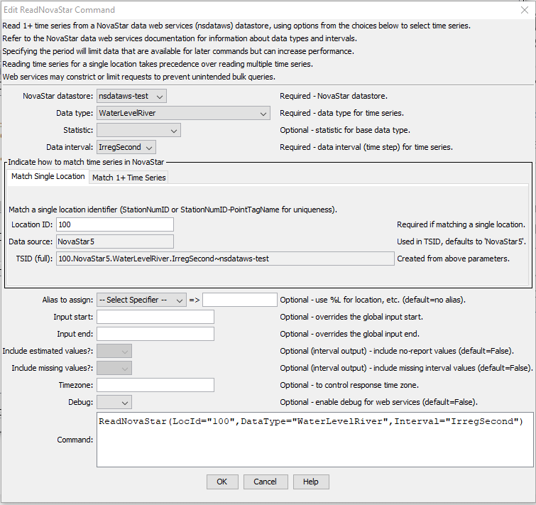
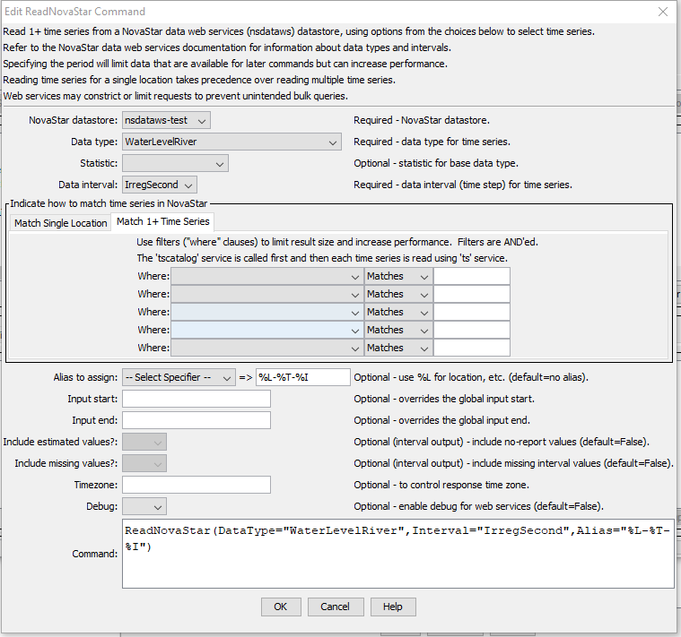

# TSTool / Command / ReadKiWIS #

* [Overview](#overview)
* [Command Editor](#command-editor)
* [Command Syntax](#command-syntax)
* [Examples](#examples)
* [Troubleshooting](#troubleshooting)
* [See Also](#see-also)

-------------------------

## Overview ##

**This documentation needs to be updated.  The command functionality is being finalized.** 

The `ReadKiWIS` command reads one or more time series from KiWIS web services
(see the [KiWIS Data Web Services Appendix](../../datastore-ref/KiWIS/KiWIS.md)).
The command is designed to utilize web service query criteria to process large numbers of time series,
for example to produce real-time information products and perform historical data analysis and quality control.

See also the 
[TSID for KiWIS](../TSID/TSID.md) time series identifier command,
which reads time series for a single time series.

The ***Data type***, ***Data interval***, and ***Where*** command parameters and input fields
are similar to those in the main TSTool interface.
However, whereas the main TSTool interface first requires a query to find the
matching time series list and interactive select to copy specific time series identifiers into the ***Commands*** area,
the `ReadNovaStar` command reads the time series list and the corresponding data for the time series.
This can greatly shorten command files and simplify command logic, especially when processing many time series.
However, because the command can process many time series and web services are impacted by network speed,
running the command can take a while to complete.

Data for the location and other time series metadata,
as shown in the main TSTool interface, are set as time series properties, using web service data values.
These properties can be transferred to a table with the
[`CopyTimeSeriesPropertiesToTable`](https://opencdss.state.co.us/tstool/latest/doc-user/command-ref/CopyTimeSeriesPropertiesToTable/CopyTimeSeriesPropertiesToTable/)
command and processed further with other table commands.

## Command Editor ##

The following dialog is used to edit the command and illustrates the syntax for the command.
Two options are available for matching time series.
The following example illustrates how to read time series for a single location by specifying the location identifier.
This approach is similar to using the
[`ReadTimeSeries`](https://opencdss.state.co.us/tstool/latest/doc-user/command-ref/ReadTimeSeries/ReadTimeSeries/)
command but offers parameters specific to NovaStar web services.

**<p style="text-align: center;">

</p>**

**<p style="text-align: center;">
`ReadNovaStar` Command Editor to Read a Single Station (<a href="../ReadNovaStar-onestation.png">see also the full-size image)</a>
</p>**

The following figure illustrates how to query multiple time series.
For example, this can be used to process all time series of a data type in the system.

**<p style="text-align: center;">

</p>**

**<p style="text-align: center;">
`ReadNovaStar` Command Editor to Read Multiple Time Series (<a href="../ReadNovaStar-multiple.png">see also the full-size image)</a>
</p>**

## Command Syntax ##

The command syntax is as follows:

```text
ReadNovaStar(Parameter="Value",...)
```

**<p style="text-align: center;">
Command Parameters
</p>**

|**Parameter**&nbsp;&nbsp;&nbsp;&nbsp;&nbsp;&nbsp;&nbsp;&nbsp;&nbsp;&nbsp;&nbsp;&nbsp;&nbsp;&nbsp;&nbsp;&nbsp;&nbsp;&nbsp;&nbsp;&nbsp;&nbsp;&nbsp;&nbsp;&nbsp;&nbsp;&nbsp;&nbsp;&nbsp;&nbsp;&nbsp;&nbsp;&nbsp;&nbsp;&nbsp;&nbsp;&nbsp;&nbsp;&nbsp;&nbsp;&nbsp;&nbsp;&nbsp;&nbsp;&nbsp;&nbsp;&nbsp;|**Description**|**Default**&nbsp;&nbsp;&nbsp;&nbsp;&nbsp;&nbsp;&nbsp;&nbsp;&nbsp;&nbsp;&nbsp;&nbsp;&nbsp;&nbsp;&nbsp;&nbsp;&nbsp;&nbsp;&nbsp;&nbsp;&nbsp;&nbsp;&nbsp;&nbsp;&nbsp;&nbsp;&nbsp;|
|--------------|-----------------|-----------------|
|`DataStore`<br>**required**|The NovaStar datastore name to use for the web services connection, as per datastore configuration files (see the [NovaStar Data Web Services Datastore appendix](../../datastore-ref/nsdataws/nsdataws.md)). | None - must be specified. |
|`DataType`<br>**required**|The data type to be queried, as documented in the [NovaStar Data Web Service Datastore appendix](../../datastore-ref/nsdataws/nsdataws.md). Only standard data types are listed.  If necessary, pick a base data type and specify `Statistic` for additional output option. |None – must be specified.|
|`Statistic`| A statistic to use, if not listed in the `DataType` choices.  The ***Data type*** list only includes standard interval data types corresponding to the `tscatalog` web service.  However, this command will perform additional calculations such as using a statistic on any base data type. |
|`Interval`<br>**required**|The data interval for the time series, as documented in the [NovaStar Data Web Services Datastore appendix](../../datastore-ref/nsdataws/nsdataws.md) (e.g. `IrregSecond`, `5Minute`, `15Minute`, `1Hour`, `1Day`, `1Month`, `1Year`), consistent with the `DataType` selection.  TSTool uses a default `tscatalog` output to determine the list of data intervals for a data type.  |None – must be specified.|
|`TSID`| A view-only value that indicates the time series identifier that will result from the input parameters when a single station is queried. | |
|`WhereN`|When reading 1+ time series, the “where” clauses to be applied.  The filters match the values in the Where fields in the command editor dialog and the TSTool main interface.  The parameters should be named `Where1`, `Where2`, etc., with a gap resulting in the remaining items being ignored.  The format of each value is:<br>`Item;Operator;Value`<br>Where `Item` indicates a data field to be filtered on, `Operator` is the type of constraint, and `Value` is the value to be checked when querying.|If not specified, the query will not be limited and very large numbers of time series may be queried.|
|`Alias`<br>|The alias to assign to the time series, as a literal string or using the special formatting characters listed by the command editor.  The alias is a short identifier used by other commands to locate time series for processing, as an alternative to the time series identifier (`TSID`).|None – alias not assigned.|
|`InputStart`|Start of the period to query, specified as a date/time with a precision that matches the requested data interval.|Read all available data.|
|`InputEnd`|End of the period to query, specified as a date/time with a precision that matches the requested data interval.|Read all available data.|
|`IncludeEstimates`| Used when returning interval time series.  Indicate whether to include values estimated by carrying forward the last report in no report interval: `True` or `False`.  This will increase the number of data values in interval time series.  Values are marked with flag `e`. | `False` |
|`IncludeMissing`| Used when returning interval time series.  Indicate whether to include missing value: `True` or `False`.  This is typically only used for troubleshooting because it greatly increases the size of the output. Values are marked with flag `m`. | `False` |
|`Timezone`| Time zone for output, used when the web services time zone is not the same as that of the station.  Specify as a time zone that includes daylight saving if applicable, for example `America/Denver`. | Output will use the server time zone. |
|`Debug`| Used for troubleshooting:  `False` or `True`. | `False` |

## Examples ##

## Troubleshooting ##

## See Also ##

* [`CopyTimeSeriesPropertiesToTable`](https://opencdss.state.co.us/tstool/latest/doc-user/command-ref/CopyTimeSeriesPropertiesToTable/CopyTimeSeriesPropertiesToTable/) command
* [`ReadTimeSeries`](https://opencdss.state.co.us/tstool/latest/doc-user/command-ref/ReadTimeSeries/ReadTimeSeries/) command
* [TSID for KiWIS](../TSID/TSID.md) command
