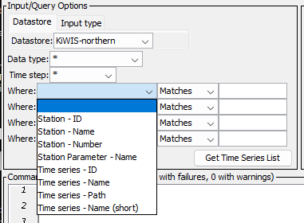
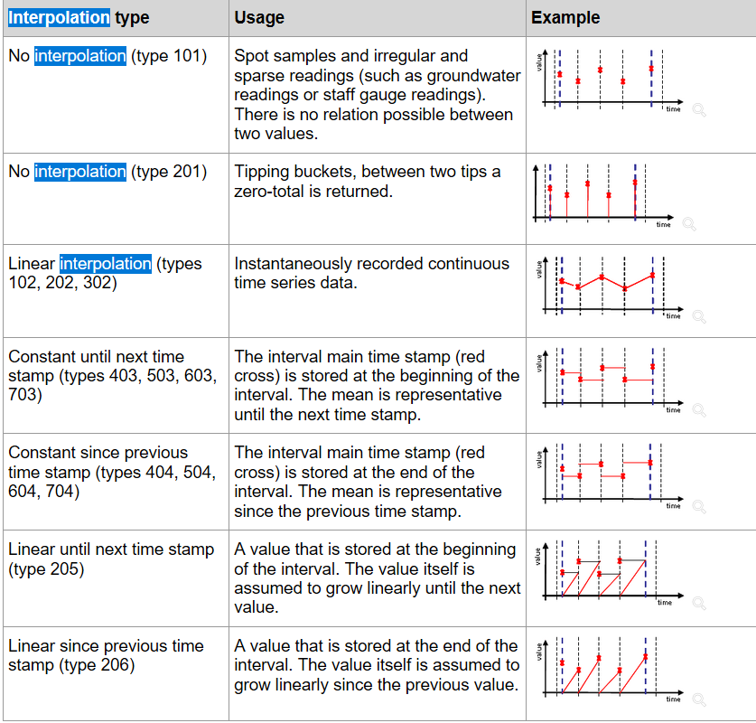

# TSTool / Datastore Reference / KiWIS Web Services #

*   [Overview](#overview)
*   [Standard Time Series Properties](#standard-time-series-properties)
*   [Other Specifications and Integration Considerations](#other-specifications-and-integration-considerations)
*   [Limitations](#limitations)
*   [Datastore Configuration File](#datastore-configuration-file)
*   [See Also](#see-also)

--------------------

## Overview ##

The KiWIS web services allow Kisters WISKI data to be queried by software,
including web applications and analysis tools such as TSTool.
TSTool accesses KiWIS web services using the KiWIS plugin.
See the following documentation:

*   [Install KiWIS Plugin appendix](../../appendix-install/install.md)
*   [KiWIS TSID command](../../command-ref/TSID/TSID.md)
*   [`ReadKiWIS` command](../../command-ref/ReadKiWIS/ReadKiWIS.md)

See the [KiWIS documentation](https://data.northernwater.org/KiWIS/KiWIS?datasource=0&service=kisters&type=queryServices&request=getrequestinfo)
for information about available web services, including web service endpoints and parameters.
This link is to the KiWIS installation at Northern Water in Colorado and KiWIS documentation is specific to the system.

TSTool primarily uses the KiWIS `getTimeseriesList` service to list time series and retrieve time series metadata,
and the `getTimeseriesValues` service to retrieve time series for display and analysis.

The TSTool [`WebGet`](https://opencdss.state.co.us/tstool/latest/doc-user/command-ref/WebGet/WebGet/)
command can be used to retrieve data from any web service and save to a file.
For example, a CSV format file can be saved and the resulting file can be read using commands such as
[`ReadTableFromDelimitedFile`](https://opencdss.state.co.us/tstool/latest/doc-user/command-ref/ReadTableFromDelimitedFile/ReadTableFromDelimitedFile/)
(to read a table) and
[`ReadDelimitedFile`](https://opencdss.state.co.us/tstool/latest/doc-user/command-ref/ReadDelimitedFile/ReadDelimitedFile/)
(to read time series). The
[`ReadTableFromJSON`](https://opencdss.state.co.us/tstool/latest/doc-user/command-ref/ReadTableFromJSON/ReadTableFromJSON/)
command can be used to read a JSON file that has been retrieved from web services.
These general commands provide flexibility to retrieve data in addition to the specific KiWIS datastore commands.

## Web Service to Time Series Mapping ##

Time series data objects in TSTool consist of various properties such as location identifier, data type, units,
and data arrays containing data values and flags.
To convert KiWIS data to time series requires joining KiWIS station, parameter, and time series list for metadata,
and time series values for data.

The TSTool main interface browsing tool displays joined information in the time series list to select time series.
The KiWIS `getTimeseriesList` service provides data for the TSTool time series list.
The ***Data type*** and ***Time step*** are general filters implemented for all datastores and the
***Where*** input filters are specific to KiWIS.

**<p style="text-align: center;">

</p>**

**<p style="text-align: center;">
TSTool Where Filters
</p>**

## Standard Time Series Properties ##

The general form of time series identifier used by TSTool is:

```
LocationID.DataSource.DataType.Interval~DatastoreName
```

If the `LocationID` does not result in a unique time series identifier,
the `LocType` can be used to avoid ambiguity by indicating the type of the location, as shown below:

```
LocType:LocationID.DataSource.DataType.Interval~DatastoreName
```

The standard time series identifier format for KiWIS web service time series is as follows,
where `KiWIS` is used for the data source.
This approach is similar to the KiWIS `ts_path`, which uses `site_no/station_no/stationparameter_no/ts_shortname`.
In most cases the `site_no` is not needed for uniqueness and TSTool currently does not require using `site_no` in the TSID.
If necessary, the TSTool KiWIS plugin can be enhanced to optionally use `site_no` in the location identifier for uniqueness.
Single quotes must be used if the `stationparameter_no` or `ts_shortname` include dash or period characters.
The resulting TSTool TSID is similar to the KiWIS `ts_path` but does not use the `site_no`.

```
station_no.KiWIS.stationparameter_no-ts_shortname.ts_spacing~DataStoreName
station_no.KiWIS.'stationparameter_no'-'ts_shortname'.ts_spacing~DataStoreName
```

The following form uses `LocationType` with KiWIS `ts_id` and ensures a unique TSID.
However, `tsid_id` is normally an internally-facing identifier and using `ts_id` for the `LocationID` makes it difficult to
directly associate the time series with the station.
Single quotes must be used if the `stationparameter_no` or `ts_shortname` include dash or period characters.
**The following form was used during development but should not be used in production systems.**

```
ts_id:123456.KiWIS.stationparameter_no-ts_shortname.ts_spacing~DataStoreName
ts_id:123456.KiWIS.'stationparameter_no'-'ts_shortname'.ts_spacing~DataStoreName
```

The meaning of the TSID parts is as follows:

*   The `LocType` syntax with KiWIS `ts_id` ensures a unique TSID.
    However, the default TSID created by the TSTool main interface does not use the `ts_id`.
*   The `LocationId` is set to:
    +   If `LocType` syntax is not used (the default behavior):
        -   The KiWIS `station_no` (text) is used.
    +   If `LocType` is `ts_id`:
        -   The KiWIS `ts_id` (integer) is used.
*   The `DataSource` is set to:
    +   The data source is currently always set to `KiWIS`.
    +   In the future it may be set to the entity from which data originates,
        such as the agency abbreviation.
    +   The `DataSource` is not currently used to uniquely identify time series
        because other KiWIS information is used.
*   The `DataType` is set to:
    +   KiWIS `stationparameter_no-ts_shortname` (`stationparameter_no`, a dash, and then `ts_shortname`).
    +   If the `stationparameter_no` contains a dash or period, surround it with single quotes.
    +   If the `ts_shortname` contains a dash or period, surround it with single quotes.
    +   The TSTool user interface ***Data type*** choice only shows the `stationparameter_no`
        but the ***Time Series List*** shows the full data type with the two parts.
*   The `Interval` is set to:
    +   If the KiWIS `ts_spacing` is blank, the time series is "non-equidistant" (irregular interval)
        and TSTool will use `IrregSecond` for the interval.
        Currently there is no attempt to determine the precision for timestamps (e.g., `IrregDay`)
        but this functionality may be added in the future.
    +   If the KiWIS `ts_spacing` is not blank,
        it is converted from the [ISO 8601 duration](https://en.wikipedia.org/wiki/ISO_8601)
        notation used by KiWIS (e.g., `P1D` for daily interval) to the TSTool form (e.g., `1Day`).
        Only durations supported by TSTool are implemented:
        -   `NMinute` - multiple of minute
        -   `NHour` - multiple of hour
        -   `Day` or `1Day`
        -   week or multiple day interval - **currently not supported but could enable [`ReadKiWIS(IrregularInterval=IrregDay)`](../../command-ref/ReadKiWIS/ReadKiWIS.md)**
        -   `Month` or `1Month` - **currently not supported but could enable [`ReadKiWIS(IrregularInterval=IrregMonth)`](../../command-ref/ReadKiWIS/ReadKiWIS.md)**
        -   `Year` or `1Year` - **currently not supported but could enable [`ReadKiWIS(IrregularInterval=IrregYear)`](../../command-ref/ReadKiWIS/ReadKiWIS.md)**
    +   If the `ts_spacing` cannot be converted to an interval handled by TSTool,
        the `ts_spacing` is passed through and TSTool may not handle the time series cleanly.
    +   The interval is for information and data management purposes and is not used to uniquely
        identify the time series within KiWIS because other KiWIS information is used (see the `DataType` above).
*   The `DatastoreName` is taken from the datastore configuration file `Name` property:
    +   The datastore name is listed in the TSTool main interface.
    +   Multiple datastores can be configured, each pointing to a different KiWIS web service.
        Therefore, datastore names should be assigned with enough detail to avoid confusion.
        The following are typical examples:
        -   `KiWIS` - general datastore name but is ambiguous if more than one KiWIS system is accessed at the same time
        -   `KiWIS-northern` - example of KiWIS web services for Northern Water
        -   `KiWIS-northern-abc` - example of KiWIS web services for Northern Water
             (if second KiWIS server or configuration is available)

Important standard time series properties include:

1.  **Time Series Description**:
    1.  The KiWIS `station_name` is used for the time series description, which is used in graph legends.
2.  **Data Units**:
    1.  The KiWIS `ts_unit_symbol` is used for time series data units.
3.  **Missing Data Value**:
    1.  The special value `NaN` is used internally for the missing data value.
        This mainly impacts regular interval (equidistant) time series where
        data gaps are represented by the missing data value.

See the next section for additional mapping of KiWIS data to TSTool time series.

## Other Specifications and Integration Considerations ##

The following are other specifications related to TSTool plugin integration with KiWIS web services.

1.  **Service URL**:
    1.  The configuration file `ServiceRootURI` property includes everything except specific service query parameters.
        This provides flexibility if different systems require different configuration parameters
        and for troubleshooting.
        See the [Datastore Configuration File](#datastore-configuration-file) section for an example.
    2.  The KiWIS landing page for an organization,
        for example [KISTERS Services](https://data.northernwater.org/KiWIS/)
        page for Northern Water, lists available services.
2. **Data Caching:**
    1.  TSTool performance, in particular interactive features, is impacted by web service query times.
        Therefore, it is desirable to cache data in memory so that software does not need to requery web services.
        The trade-off is that when data are cached, changes in the WISKI database will not be visible in the TSTool
        session unless TSTool rereads the data.
        There is a balance between performance and having access to the most recent data.
    2.  Currently, TSTool does cache some data to quickly populate the interface choices
        based on user selections,
        such as the data type list shown in the main user interface and `ReadKiWIS` command.
        These items are determined by processing the time series catalog (list) from
        the `getTimeseriesList` service output.
    3.  No time series list or data values are cached when reading time series.
        Requesting a time series based on its TSID will query the `getTimeseriesList` and
        `getTimeseriesValues` services.
        The response may be subject to limits as discussed in the next item.
    4.  If performance or stale data are an issue, the implementation can be revisited.
    5.  If necessary, restart TSTool to use the latest KiWIS data,
        such as if new station parameters have been added that are not reflected in the TSTool user interface choices.
    6.  KiWIS itself implements data caching to improve performance.
        For example, content matching URLs may be cached for a short period (e.g., 1 minute) based on the system configuration.
3.  **Response Limits (Data Throttling)**:
    1.  KiWIS has the ability to throttle requests by limiting the number of records returned for data and graphs.  
        The KiWIS system administrator can set the limits.
    2.  TSTool may return an incomplete historical record if limits are less than the full time series period.
4.  **Quality code:**
    1.  The `KiWIS Quality Code` field returned by the `getTimeseriesValues` service is an integer
        that must be converted to text using output from the `getQualityCodes` service.
        An integer is returned by the `getTimeseriesValues` service and the
        corresponding text code is a full word, such as `Excellent`.
        The full word is used for the TSTool time series data flag.
    2.  It may be possible to use a single character (or abbreviation) mapped to the numerical codes.
        This may be more of an issue if other time `getTimeseriesValues` flags are implemented in the future.
5.  **Time zone:**
    1.  KiWIS internally stores data in UTC and web service times are in local time with time zone specified,
        and the time zone can be specified at station and time series level in the database.
    2.  The TSTool KiWIS plugin currently does not take any specific actions with the time zone in returned values.
        Time series period and data values use times read from data without attempting to interpret or shift time zone.
6.  **Timestamp and Data Interval:**
    1.  Irregular interval:
        *   The timestamp indicates the time of the observation or computed value.
        *   No adjustment to the timestamp is required.
    2.  Regular interval less than a day:
        *   If necessary, timestamps are adjusted to align with the end of the interval for a value.
            Time series values that have "Constant until next time stamp" interpolation types as shown in the following figure are shifted.
        *   The value applies for the interval ending with the timestamp.
    3.  Regular interval for a day:
        *   If necessary, timestamps are adjusted to be the end of the interval for a value.
            Time series values that have "Constant until next time stamp" interpolation types as shown in the following figure are shifted.
        *   The KiWIS web services `getTimeseriesValues` service returns date and time even for daily or larger interval
            (e.g., `2022-04-22T00:00:00-07:00`) because a day may be defined other than midnight to midnight.
            A warning will be generated and the `ReadKiWIS(IrregularInterval=...)` command should be used to
            read as an irregular time series that includes the offset hour.
        *   For a time as shown above and `ts_spacing` of `P1D` the TSTool KiWIS plugin will
            by default use a date of `2022-04-21` (previous day as if hour 24 is midnight) and discard the time.
            The resulting data should be interpreted as the value applying for the day.
        *   See the [`ReadKiWIS`](../../command-ref/ReadKiWIS/ReadKiWIS.md) command
            `IrregularInterval`, `Read24HourAsDay`, and `ReadDayAs24Hour` parameters to control how daily time series are read.
    4.  Regular interval for longer than day:
        *   **Not currently supported.**

**<p style="text-align: center;">

</p>**

**<p style="text-align: center;">
KiWIS Interpolation Types (<a href="../interpolation-type.png">see also the full-size image)</a>
</p>**

## Limitations ##

The following limitations and design issues have been identified during development of the KiWIS plugin.
Additional software development is required to overcome these limitations.

1.  **Web service version:**
    1.  There is currently no way to retrieve the web service version from web services.
        The documentation for the `getrequestinfo` service shows the API version (e.g., "Version 1.9.8")
        but this is not available in any service response.
    2.  Because the version cannot be obtained, the `#@require` comment cannot be implemented to check the datastore version.
        This feature is useful to ensure that workflows are consistent with the datastore version.
        This feature could be enabled in the future if the KiWIS web services returned the version.
2.  **Unique time series identifier:** - The KiWIS `ts_path` provides a unique identifier that is similar to the TSTool TSID:
    1.  TSTool does not currently use the `site_no` in the TSID because `site_no` is used to group stations
        in a regional area, but `station_no` is typically unique without needing to use the `site_no`.
        The `site_no` might need to be used if a large system contains, for example,
        neighboring flood warning systems that use the same `station_no` in each system.
        The TSTool KiWIS design will be enhanced if this needs to be addressed.
    2.  The data interval in the TSID is not currently used to uniquely identify the time series
        because other TSID parts result in a unique identifier.
        The data interval is used by the software to filter time series lists and manage how data are stored in time series.
3.  **Time period:**
    1.  The KiWIS web services may return extra data depending on the requested period.
        For example, requesting a partial day returns the entire day.
        This issue may need additional study to resolve.
4.  **Month and Year Interval:**
    1.  **Month and year interval are not currently supported by the TSTool KiWIS plugin.**
        More information is needed to understand whether the timestamp time is significant or can
        be ignored, similar to the day interval midnight issue.
5.  **Regular interval interpolation types:**
    1.  Interpolation type is used to determine whether the timestamp in KiWIS is at the beginning
        or end of a regular interval.  Currently the "Linear until next timestep" interpolation interval
        is not handled because it is not clear if the timestamp can be moved to the end of the interval.
6.  **Time series manipulation:**
    1.  The KiWIS `getTimeseriesValues` service is quite complex and allows returning many fields
        and performing manipulations on the time series, such as aggregating and filling.
        Similar manipulations are provided by TSTool commands.
        The initital implementation of the TSTool KiWIS plugin does not attempt to use advanced
        features of the `getTimeSeriesValues` service.
        Allowing those query parameters in the `ReadKiWIS` command would allow, for example,
        comparing KiWIS calculations with TSTool calculations.
    2.  One complication is that because the manipulations occur "on the fly",
        additional work is needed to ensure that TSTool's representation of the resulting time series is correct,
        such as the data type, interval, etc.
        Currently, TSTool uses the `getTimeseriesList` information to create a catalog of time series for
        interactive viewing and creating time series identifiers.
        Determining unique identifiers for time series that are derived from input would require more work.

## Datastore Configuration File ##

A datastore is configured by creating a datastore configuration file.

Create a user datastore configuration file `.tstool/NN/datastores/KiWIS-northern.cfg` (or similar) in the user's files,
for example by copying and modifying the following example, or copying from another installation.
The `NN` should agree with the major TSTool version, for example `14` as shown by the ***Help / About TSTool*** menu.
TSTool will attempt to open datastores for all enabled configuration files.

The following illustrates the KiWISDataStore datastore configuration file format
and configures a datastore named `KiWIS-northern`.
The `Name` property is the datastore name that will be used by the TSTool - the file name can be any name
but is often the same as the `Name` with extension `.cfg`.

```
# Configuration information for KiWISDataStore plugin datastore.
# This allows remote access to the KiWIS database using web services.
#
# The user will see the following when interacting with the datastore:
#
# Name - datastore name used in applications
# Description - datastore description for reports and user interfaces (short phrase)
#
# The following are needed to make database connection:
#
# Enabled - whether the datastore is enabled
# Type - must be KiWISDataStore
# Name - for example "KiWIS", "KiWIS-northern"
# ServiceRootURI - the web service root URI - specific services are appended

Enabled = True
#Enabled = False
Type = "KiWISDataStore"
Name = "KiWIS-northern"
Description = "Northern Water Kisters WISKI (KiWIS) web services"
ServiceRootURI = "https://data.northernwater.org/KiWIS/KiWIS?service=kisters&type=queryServices&datasource=0"
ServiceApiDocumentationURI = "https://data.northernwater.org/KiWIS/KiWIS?datasource=0&service=kisters&type=queryServices&request=getrequestinfo"
```

**<p style="text-align: center;">
KiWIS Web Services DataStore Configuration File
</p>**

The following table describes configuration file properties.
Contact the KiWIS system administrator to obtain configuration information for the specific system,
or see online information for the system.

**<p style="text-align: center;">
KiWIS Web Services DataStore Configuration File Properties
</p>**

| **Property**&nbsp;&nbsp;&nbsp;&nbsp;&nbsp;&nbsp;&nbsp;&nbsp;&nbsp;&nbsp;&nbsp;&nbsp;&nbsp;&nbsp;&nbsp;&nbsp;&nbsp;&nbsp;&nbsp;&nbsp;&nbsp;&nbsp;&nbsp;&nbsp;&nbsp;&nbsp;&nbsp;&nbsp;&nbsp;&nbsp;&nbsp;&nbsp;&nbsp;&nbsp;&nbsp;&nbsp;&nbsp;&nbsp;&nbsp;&nbsp; | **Description** | **Default** |
| -- | -- | -- |
| `Description`<br>**required** | Description of the datastore, typically a short sentence, used in some displays. | None - must be specified. |
| `Enabled` | Indicates whether the datastore is enabled. | `True` |
| `Name`<br>**required** | Datastore name that is used in the TSTool software and KiWIS commands.  The name should be unique across all datastores. | None - must be specified. |
| `ServiceApiDocumentationURI` | The URL for the web services API documentation, specific to the system.  This is used by software to display system-specific documentation. | Documentation will not be available from command editors. |
| `ServiceRootURI`<br>**required** | The root URL for the web services.  This should include everything except the service name and query parameters (the specific service name and query parameters are automatically specified by software to query data). | None - must be specified. |
| `Type`<br>**required** | Must be `KiWISDataStore`, which is used by TSTool to identify which plugin software to use for the datastore. | None - must be specified. |

## See Also 

*   [KiWIS TSID](../../command-ref/TSID/TSID.md) command
*   [`ReadDelimitedFile`](https://opencdss.state.co.us/tstool/latest/doc-user/command-ref/ReadDelimitedFile/ReadDelimitedFile/) command
*   [`ReadKiWIS`](../../command-ref/ReadKiWIS/ReadKiWIS.md) command
*   [`ReadTableFromDelimitedFile`](https://opencdss.state.co.us/tstool/latest/doc-user/command-ref/ReadTableFromDelimitedFile/ReadTableFromDelimitedFile/) command
*   [`ReadTableFromJSON`](https://opencdss.state.co.us/tstool/latest/doc-user/command-ref/ReadTableFromJSON/ReadTableFromJSON/) command
*   [`WebGet`](https://opencdss.state.co.us/tstool/latest/doc-user/command-ref/WebGet/WebGet/) command
