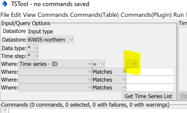
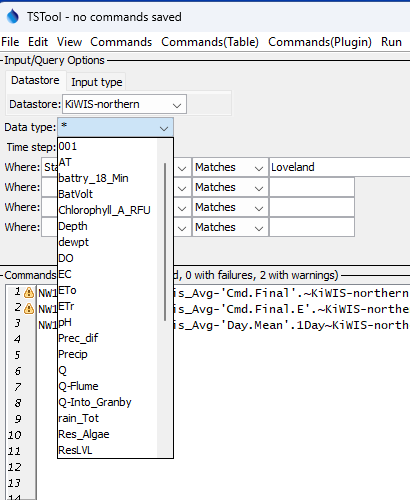

# TSTool / Troubleshooting #

Troubleshooting TSTool for KiWIS involves confirming that the core product and plugin are performing as expected.
Issues may also be related to KiWIS data.

*   [Troubleshooting Core TSTool Product](#troubleshooting-core-tstool-product)
*   [Troubleshooting KiWIS TSTool Integration](#troubleshooting-kiwis-tstool-integration)
    +   [***Commands(Plugin)*** Menu Contains Duplicate Commands](#commandsplugin-menu-contains-duplicate-commands)
    +   [TSTool User Interface or Command Editor Don't Provide Choices](#tstool-user-interface-or-command-editor-dont-provide-choices)
    +   [Web Service Datastore Returns no Data](#web-service-datastore-returns-no-data)

------------------

## Troubleshooting Core TSTool Product ##

See the main [TSTool Troubleshooting documentation](https://opencdss.state.co.us/tstool/latest/doc-user/troubleshooting/troubleshooting/).

## Troubleshooting KiWIS TSTool Integration ##

The following are typical issues that are encountered when using TSTool with KiWIS.
The ***View / Datastores*** menu item will display the status of datastores.
The ***Tools / Diagnostics - View Log File...*** menu item will display the log file.

### ***Commands(Plugin)*** Menu Contains Duplicate Commands ###

If the ***Commands(Plugin)*** menu contains duplicate commands,
TSTool is finding multiple plugin `jar` files.
To fix, check the `plugins` folder and subfolders for the software installation folder
and the user's `.tstool/NN/plugins` folder.
Remove extra jar files, leaving only the version that is desired (typically the most recent version).

### TSTool User Interface or Command Editor Don't Provide Choices ###

The TSTool main user interface or [`ReadKiWIS`](../command-ref/ReadKiWIS/ReadKiWIS.md) editor may
show incomplete data type, time step, or other choices, for example as shown in the following image:

**<p style="text-align: center;">

</p>**

**<p style="text-align: center;">
TSTool Query Options with Missing Filter Options (<a href="../missing-filter-choices-problem.png">see also the full-size image)</a>
</p>**

The interface ***should*** appear similar to the following.

**<p style="text-align: center;">

</p>**

**<p style="text-align: center;">
TSTool Query Options with Populated Filter Options (<a href="../missing-filter-choices-ok.png">see also the full-size image)</a>
</p>**

The problem may be blocked internet connectivity to the web service site:

1.  Use the ***View / Datastores*** menu to confirm that the datastore configuration is OK, in particular the URL.
2.  Use the ***Tools / Diagnostics - View Log File*** menu to view the log file messages.
    Search for "KiWIS" to see if error messages are present.
    An error similar to the following may require configuring a security certificate or firewall on the computer
    to allow access to the web services address.
    Contact support for the organization for help.

```
Warning[3] (KiWISDataStore.readGlobalData):  Error reading global quality codes (java.net.ssl.SSLHandshakeException)....
Warning[3] (KiWISDataStore.readGlobalData):  sun.security.validator.ValidatorException...
```

### Web Service Datastore Returns no Data ###

If the web service datastore returns no data, check the following:

1.  Review the TSTool log file for errors.
    Typically a message will indicate an HTTP error code for the URL that was requested.
2.  Copy and paste the URL into a web browser to confirm the error.
    The browser will typically show a specific web service error message such as a
    missing query parameter or typo.
3.  See the [KiWIS documentation](https://data.northernwater.org/KiWIS/KiWIS?datasource=0&service=kisters&type=queryServices&request=getrequestinfo)
    to check whether the URL is correct.
4.  Contact KiWIS support for the data publisher to determine whether data limits are in place.

If the issue cannot be resolved, contact the [Open Water Foundation](https://openwaterfoundation.org/about-owf/staff/).
